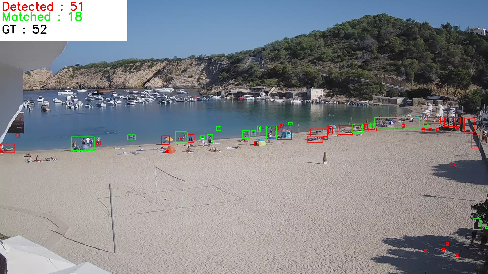

# A simple detector for crowd counting using OpenCV and Python

# Execution

> Be coherent, if changed the image path you need to specify the path of the empty image

    usage: main.py [-h] [-p | --plot | --no-plot] [-f FOLDER] [-e EXTENSION] [-em EMPTY]

    A simple program for person detectection and crowd counting in beautiful pictures!

    options:
    -h, --help            show this help message and exit

    -p, --plot, --no-plot
                            Plot the results with matplotlib at the endof the execution (default: False)

    -f FOLDER, --folder FOLDER
                            Custom path to the images

    -e EXTENSION, --extension EXTENSION
                            Custom extension to the images to load

    -em EMPTY, --empty EMPTY
                            Specify the path to the empty image

For a basic execution just :
    
    # If you want a mathplotlib window pop up with the images
    python3 main.py --plot

    # If you want just to ejecute and check directly on the gen folder
    python3 main.py

## Terminal Output
    File ->  1660309200.jpg  Precission =  0.5294117647058824  |  63  of  90  detections
    File ->  1660302000.jpg  Precission =  0.4461538461538462  |  58  of  103  detections
    File ->  1660294800.jpg  Precission =  0.5353535353535354  |  53  of  72  detections
    File ->  1660320000.jpg  Precission =  0.7647058823529411  |  104  of  135  detections
    File ->  1660287600.jpg  Precission =  0.275               |  11  of  17  detections
    File ->  1660298400.jpg  Precission =  0.6631578947368421  |  63  of  106  detections
    File ->  1660305600.jpg  Precission =  0.5945945945945946  |  66  of  101  detections
    File ->  1660316400.jpg  Precission =  0.8880597014925373  |  119  of  139  detections
    File ->  1660291200.jpg  Precission =  0.6666666666666666  |  34  of  52  detections

# OUTPUT

Final detections

Detections that match with the ground truth (NOT THE OUTPUT)

